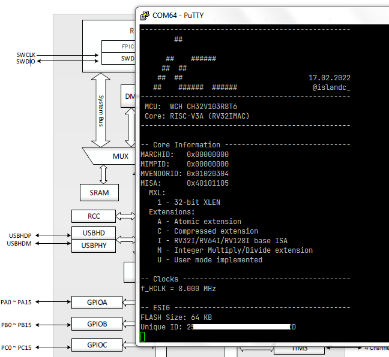

# hello-ch32v103

A simple "Hello World"-like project for the WCH CH32V103 RISC-V MCU.

<p align="center"></p>

This project contains a simple set of modules to get the MCU running in a minimal configuration:
  - Serial I/O on USART1 (connected to WCH-Link VCP)
  - SysTick enabled and using empty dummy interrupt handler
  - TIM3 Channel 1 configured for PWM output to LED
  - ADC1 internal temperature sensor and Vrefint readout

## Requirements

- WCH CH32V103R8T6-EVT-R1 Evaluation Kit (available from LCSC, [PartNr `C2943982`](https://lcsc.com/product-detail/Development-Boards-Kits_WCH-Jiangsu-Qin-Heng-CH32V103R8T6-EVT-R1_C2943982.html)) + USB-A to USB-C Cable
- [MounRiver Studio IDE](http://www.mounriver.com/)
- Serial terminal program, e.g. [PuTTy](https://www.putty.org/) or minicom

## Hardware Setup

* Connect the `LED1` and `PA6` pins on header `J3` using a female-female jumper wire

## Usage

* Clone this repository using the following command. Note the use of the `--recursive` tag.
  ```
  git clone --recursive https://github.com/islandcontroller/hello-ch32v103
  ```
* Load this project in **MounRiver Studio** and build the executable
* Open a serial terminal on the WCH-Link programmer's VCP (**115200 Baud, 8N1**)
* Flash the firmware to the MCU using the provided `.launch` script
* Resume execution once breakpoint in `main()` is reached
* Press `?` in the serial terminal to show available commands

## Licensing

If not stated otherwise in the specific file, the contents of this project are licensed under the MIT License. The full license text is provided in the [`LICENSE`](LICENSE) file.

    SPDX-License-Identifier: MIT

## References

* [openwch/ch32v103](https://github.com/openwch/ch32v103) Manufacturer EVT demos and documentation
* [CH32V103DS0.pdf](https://github.com/openwch/ch32v103/blob/main/Datasheet/CH32V103DS0.PDF) MCU Datasheet
* [CH32xRM.pdf](http://www.wch-ic.com/downloads/CH32xRM_PDF.html) MCU Reference Manual
