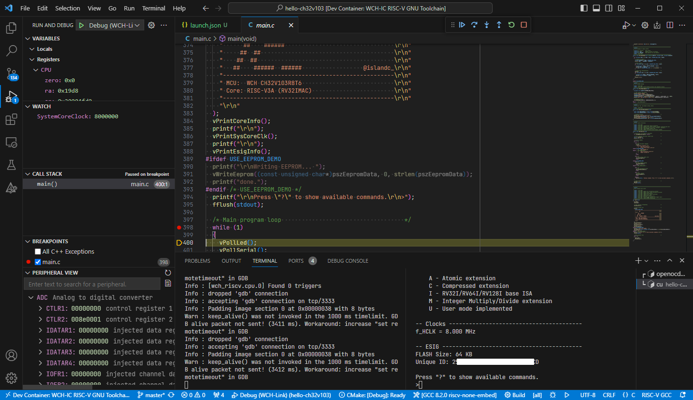

# hello-ch32v103 (VSCode) [](LICENSE) [](https://t.co/Qbblvmfbae)

A simple "Hello World"-like project for the WCH CH32V103 RISC-V MCU.

<p align="center"></p>

This project contains a simple set of modules to get the MCU running in a minimal configuration:
  - Serial I/O on USART1 (connected to WCH-Link VCP)
  - SysTick enabled and using empty dummy interrupt handler
  - TIM3 Channel 1 configured for PWM output to LED
  - ADC1 internal temperature sensor and Vrefint readout
  - I2C2 interface with 24C64 EEPROM read and write access

## Requirements

* Hardware
  * WCH CH32V103R8T6-EVT-R1 Evaluation Kit (available from LCSC, [PartNr `C2943982`](https://lcsc.com/product-detail/Development-Boards-Kits_WCH-Jiangsu-Qin-Heng-CH32V103R8T6-EVT-R1_C2943982.html)) + USB-A to USB-C Cable
  * (optional) Female-female jumper wires
  * (optional) AT24C64 EEPROM IC + Solderless breadboard + 2x 10k Resistors
* Software
  * Linux OS or WSL installation
  * [Docker Engine](https://docs.docker.com/engine/install/debian/) (running within WSL if applicable)
  * VSCode [Dev Containers](https://marketplace.visualstudio.com/items?itemName=ms-vscode-remote.remote-containers) extension
  * (WSL only) [usbipd-win](https://learn.microsoft.com/en-us/windows/wsl/connect-usb) (Windows *and* WSL parts installed!)

## Hardware Setup (optional)

* Connect the `LED1` and `PA6` pins on header `J3` using a female-female jumper wire
* Connect the 24C64 EEPROM to `PB10` and `PB11` and add 10k pull-up resistors to SDA and SCL:
  ```
       .___________.  VCC   VCC VCC       VCC  .________________
      1|    |_|    |8  |     |   |         |   |
   +---| A0    VCC |---+    .|. .|.        +---| VCC (3V3)
   |  2|           |7       | | | | R1,R2      |
   o---| A1     WP |---+    |_| |_| 10k    +---| GND
   |  3|           |6  |     |   |         |   |
   o---| A2    SCL |---(-----o---(---------(---| PB10 (I2C2_SCL)
   |  4|           |5  |         |         |   |
   o---| GND   SDA |---(---------o---------(---| PB11 (I2C2_SDA)
   |   |___________|   |                   |   |________________
  GND  U2             GND                 GND  U1
       AT24C64 (DIP8)                          CH32V103R8T6
  ```

## Usage

* Clone this repository using the following command. Note the use of the `--recursive` tag.
  ```
  git clone --recursive https://github.com/islandcontroller/hello-ch32v103
  ```
* Open the folder in VSCode
* Connect WCH-Link debug probe
  * (WSL only) attach to WSL using `usbipd wsl attach --busid <...> -a`.
* Run the command "**Dev Containers: Reopen in Container**"
* Upon prompt, select the "**GCC x.x riscv-none-embed**" CMake Kit. 
* Run "**CMake: Configure**"
* Build using "**CMake: Build [F7]**"
* Open a new Terminal tab and start OpenOCD

      openocd -f /opt/openocd/bin/wch-riscv.cfg

* Split the terminal tab using the `[|]`-Button or press `Ctrl + Shift + 5`. Then launch the serial monitor:

      cu -l /dev/ttyACM0 -s 115200

  **To close the connection later on, press ESC/ENTER, type `~.` (tilde, dot) and wait for 3 seconds.**

* Start debugging using "**Debug: Start Debugging [F5]**"
* Continue execution once the breakpoint in `main()` is reached.
* Type `?` in the serial monitor Terminal tab to show available commands.

### **Note**

If you want to use the EEPROM demo, remove the comment at the start of the `#define USE_EEPROM_DEMO` line at the top of `main.c`. The demo is disabled by default.

## Licensing

If not stated otherwise in the specific file, the contents of this project are licensed under the MIT License. The full license text is provided in the [`LICENSE`](LICENSE) file.

    SPDX-License-Identifier: MIT

## Help and References

* [openwch/ch32v103](https://github.com/openwch/ch32v103) Manufacturer EVT demos and documentation
* [WCH-IC: CH32V103DS0.pdf](http://www.wch-ic.com/downloads/CH32V103DS0_PDF.html) MCU Datasheet
* [WCH-IC: CH32xRM.pdf](http://www.wch-ic.com/downloads/CH32xRM_PDF.html) MCU Reference Manual
* [WCH-IC: QingKeV3_Processor_Manual.pdf](http://www.wch-ic.com/downloads/QingKeV3_Processor_Manual_PDF.html) Processor Core Manual

If you're looking for further information about WCH products, check out their community Discord server: 
[](https://t.co/Qbblvmfbae)